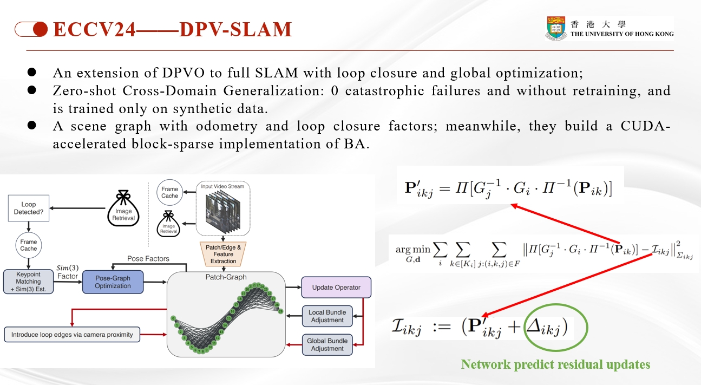

[comment]: <> (# DPV-SLAM)

<!-- PROJECT LOGO -->

<p align="center">

  <h1 align="center"> DPV-SLAM (复现及中文注释版~仅供个人学习记录用)
  </h1>

[comment]: <> (  <h2 align="center">PAPER</h2>)
  <h3 align="center">
  <a href="https://arxiv.org/pdf/2408.01654" target="_blank">Paper</a> 
  | <a href="https://github.com/princeton-vl/DPVO" target="_blank">Original Github Page</a>
  | <a href="https://github.com/KwanWaiPang/DPVO_comment" target="_blank">DPVO的配置与测试</a>
  </h3>
  <div align="center"></div>


<p align="center">
  
</p>

# 配置过程记录
* 下载源码并配置conda环境。虽然之前已经配置过dpvo的环境了，但是看yaml代码似乎变换比较大，重新配置为dpv_slam
~~~
git clone https://github.com/princeton-vl/DPVO.git --recursive

conda env create -f environment.yml
conda activate dpv_slam
conda remove --name dpv_slam --all
~~~

* 下载安装eigen库以及安装DPVO包
~~~
#如果直接用本仓库的代码不需要下载
wget https://gitlab.com/libeigen/eigen/-/archive/3.4.0/eigen-3.4.0.zip
unzip eigen-3.4.0.zip -d thirdparty

# install DPVO (感觉配置文件有点问题，尝试换回DPVO conda环境。conda activate dpvo但是这又导致需要重新配置，为此还是修改environment里面的版本吧~)
pip install .

#模型直接用回之前的试试
地址为：
/home/gwp/DPVO/dpvo.pth
数据地址为：
/home/gwp/DPVO/movies/
~~~
* 安装可视化工具
~~~
./Pangolin/scripts/install_prerequisites.sh recommended #前面应该已经安装过的了~
mkdir Pangolin/build && cd Pangolin/build
cmake ..
make -j8
sudo make install
cd ../..
pip install ./DPViewer #这个应该是安装到conda环境中的~
~~~
* 对于回环部分
~~~
# 首先需要安装opencv
sudo apt-get install -y libopencv-dev

cd DBoW2
mkdir -p build && cd build
cmake .. # tested with cmake 3.22.1 and gcc/cc 11.4.0 on Ubuntu
make # tested with GNU Make 4.3
sudo make install
cd ../..
pip install ./DPRetrieval #这个应该是安装到conda环境中的~
~~~

# 运行测试
~~~
python demo.py \
    --imagedir=<path to image directory or video> \
    --calib=<path to calibration file> \
    --viz # enable visualization
    --plot # save trajectory plot
    --save_ply # save point cloud as a .ply file
    --save_trajectory # save the predicted trajectory as .txt in TUM format
    --save_colmap # save point cloud + trajectory in the standard COLMAP text 
    --opts LOOP_CLOSURE True # To run DPVO with a SLAM backend (i.e., DPV-SLAM), add
    
# 采用iphone数据
conda activate dpv_slam

#重新下载数据和模型
python demo.py \
    --imagedir=movies/IMG_0495.MOV  \
    --calib=calib/iphone.txt\
    --viz \
    --plot \
    --save_trajectory \
    --save_colmap\
    --opts LOOP_CLOSURE True
~~~

* 测试效果请见B站链接<sup>[1](https://www.bilibili.com/video/BV1n9Yee6Eh8/), [2](https://www.bilibili.com/video/BV1cXYeeGEeh/)</sup>.感觉可视化效果有待改进吧

# Debug及代码阅读记录
* 提供了debug的[脚本](.vscode/launch.json)
* 运行时可视化pose轨迹：B站链接<sup>[1](https://www.bilibili.com/video/BV1WuYLeZERs/)</sup>
* DPVO中有5种特征（前面3中是CNN产生的，后面3中是RNN中要用的）:
  * image对应的fmap（matching feature）
  * patch特征图gmap（matching feature）
  * patch对应的imap （context feature）
  * net 是RNN迭代更新的hidden state
  * corr是correlation feature，是由```image对应的fmap（matching feature）```和```patch特征图gmap（matching feature）```执行相关操作中产生的